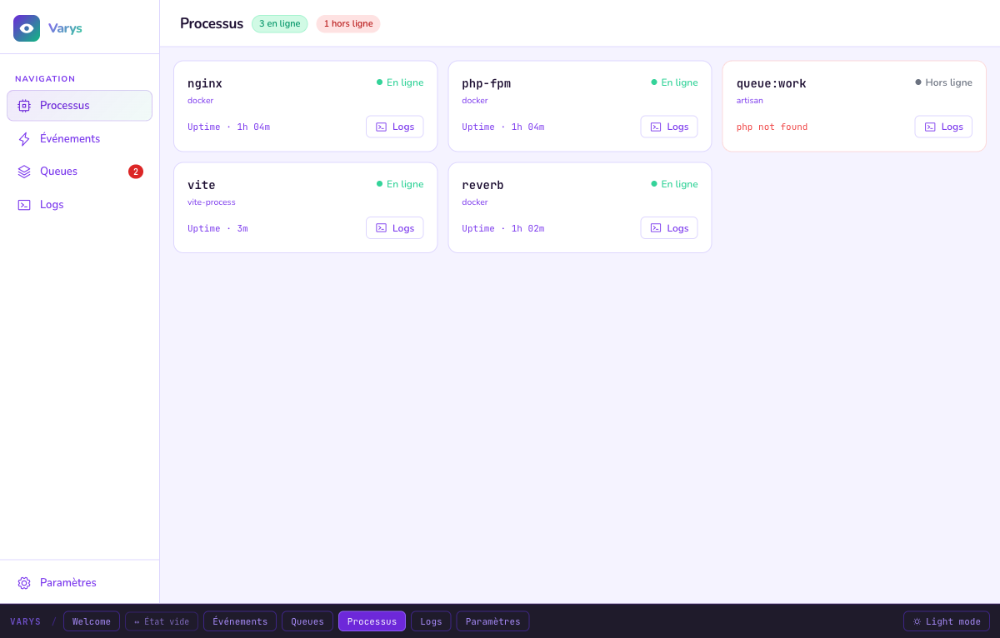
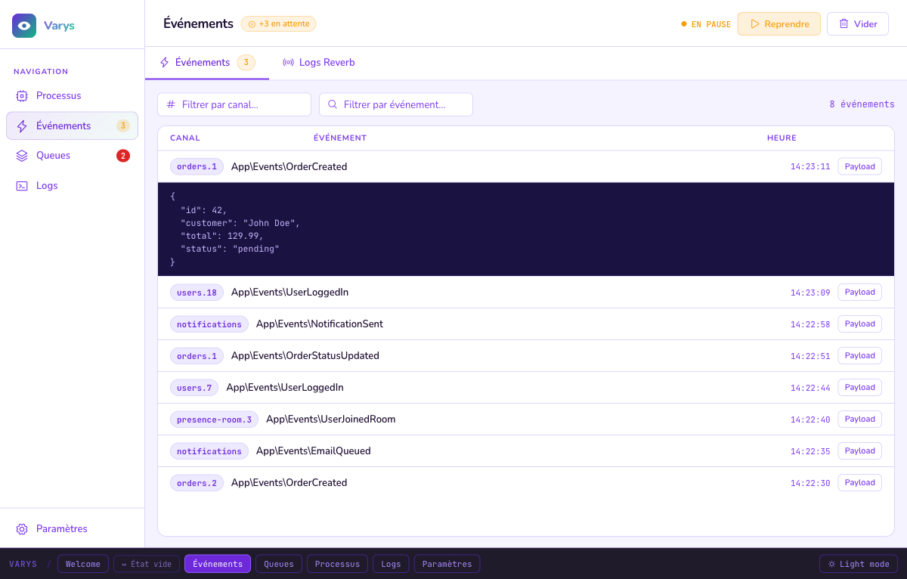
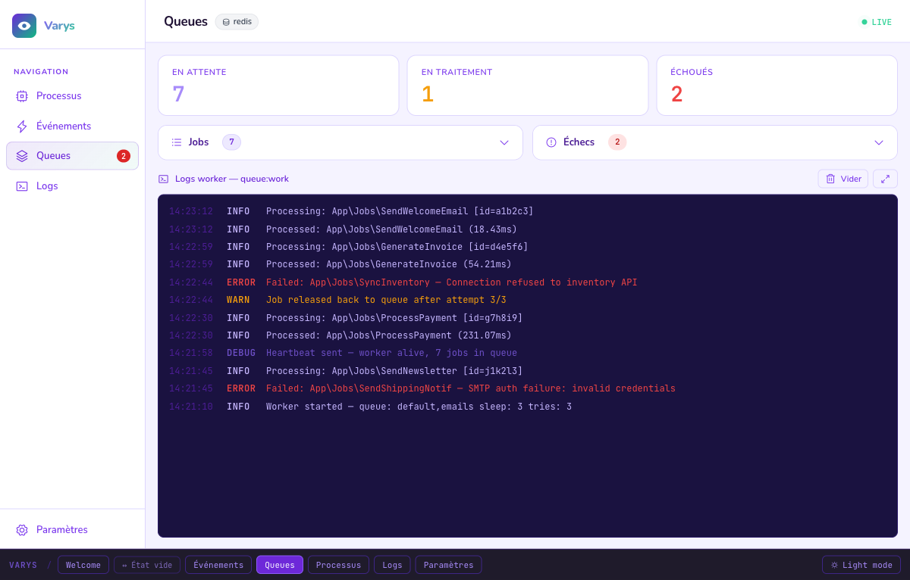
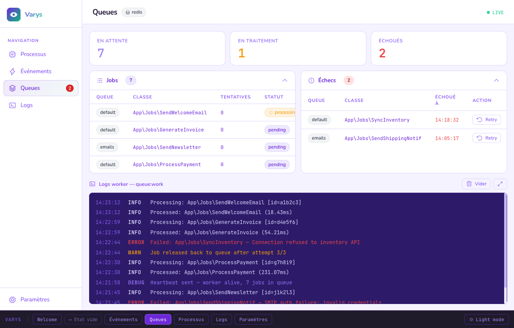
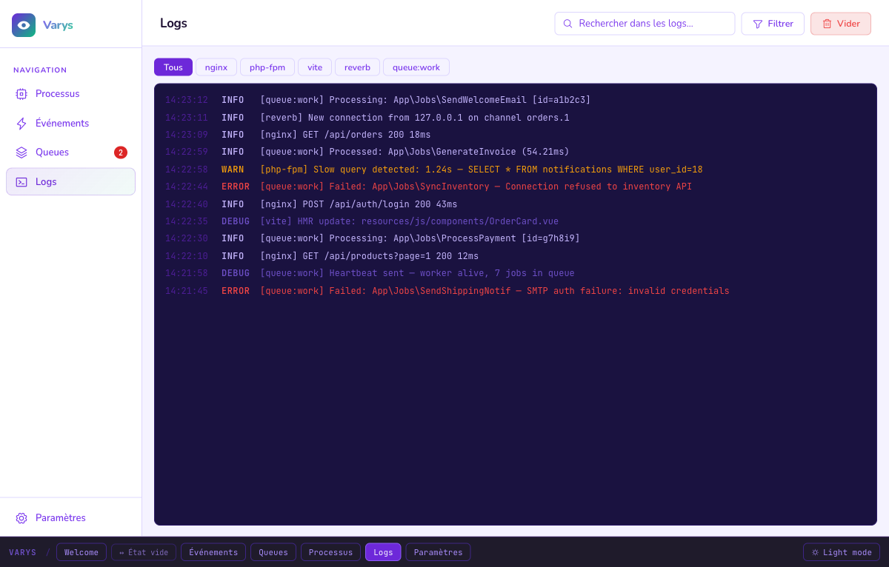

# Varys

> "I have little birds everywhere, even in the North." — Varys, Master of Whisperers

[](https://github.com/fm-hddev/laravel-varys/actions/workflows/ci.yml)
[](LICENSE)


**Varys** is a macOS desktop app that gives Laravel developers a real-time view of their local stack: processes, Reverb broadcast events, queues, and logs — in a single window, without modifying the Laravel app.

<!-- GIF demo coming soon -->







---

## Features

| View | What you see |
|------|-------------|
| **Processes** | Docker containers + Artisan commands + Vite — with live log tailing per process |
| **Events** | Real-time Reverb broadcasts via Redis pub/sub — pause, filter, inspect payloads |
| **Queues** | Pending / processing / failed counters per queue, multi-driver (MySQL, PG, SQLite, Redis) |
| **Logs** | Live tail of `storage/logs/*.log` with level filtering (DEBUG / INFO / WARNING / ERROR / CRITICAL) |

---

## Install

1. [Download **Varys.dmg**](https://github.com/fm-hddev/laravel-varys/releases/latest) from GitHub Releases
2. Open the DMG and drag **Varys.app** to `/Applications`
3. Launch Varys → select your Laravel project folder

> **Gatekeeper note**: Varys is not code-signed yet. On first launch, right-click → **Open** to bypass the unsigned app warning.

---

## Getting Started (3 steps)

1. Open Varys → click **"Select Laravel project"** → pick your project folder
2. Varys probes your stack (Docker, Redis, DB, logs) and shows a health report
3. Click **"Continue"** → monitor processes, events, queues, and logs in real time

---

## Requirements

| Requirement | Details |
|---|---|
| macOS | 13 Ventura or later |
| Node.js | 20+ (dev only) |
| Laravel project | `.env` file at project root |
| Redis | Required for Reverb events view (`REVERB_SCALING_ENABLED=true`) |
| Docker | Optional — detected automatically for the Processes view |

---

## Optional: `varys/laravel-agent`

```bash
composer require varys/laravel-agent --dev
```

Unlocks enriched features: job retry from the UI, routes snapshot, detailed healthcheck endpoint.

---

## Architecture

```
packages/
  core/       — domain types + IPC channel contracts
  main/       — Electron main process (ConfigStore, AdapterRegistry, IPC handlers)
  renderer/   — React 19 + Tailwind v4 + Zustand + React Query

adapters/
  dotenv/           — reads .env → ProjectContext
  docker/           — Docker process monitoring
  artisan-process/  — artisan + php processes via ps
  vite-process/     — Vite dev server detection
  log-file/         — log file tailing (chokidar)
  laravel-queue/    — queue stats (MySQL/PG/SQLite/Redis)
  reverb-redis/     — Reverb broadcast capture via Redis SUBSCRIBE
  varys-agent/      — optional HTTP agent for enriched data
```

Each data source is behind a `DataSourceAdapter` interface — fully independent, testable, and opt-in.

→ See [docs/adr/](docs/adr/) for architecture decision records.
→ See [docs/performance.md](docs/performance.md) for performance budgets.

---

## Contributing

→ [CONTRIBUTING.md](CONTRIBUTING.md) — setup, commit conventions, code standards.

---

## License

MIT — Copyright (c) 2026 Frédéric Moras
